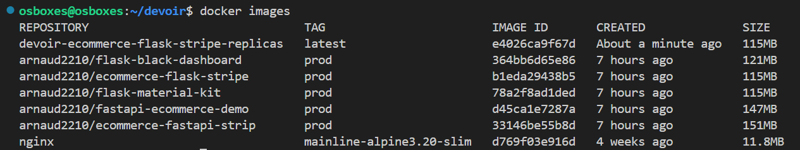
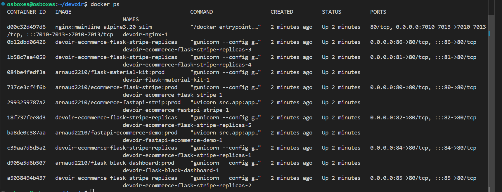
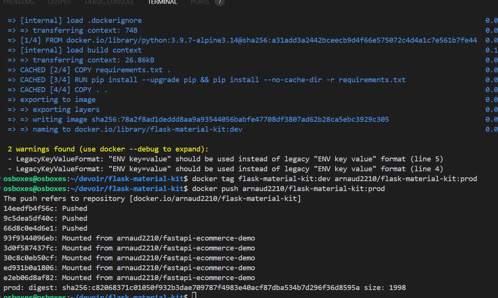
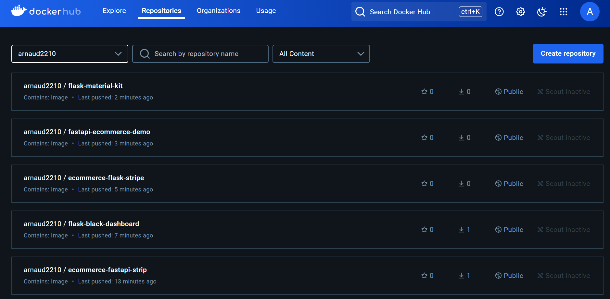
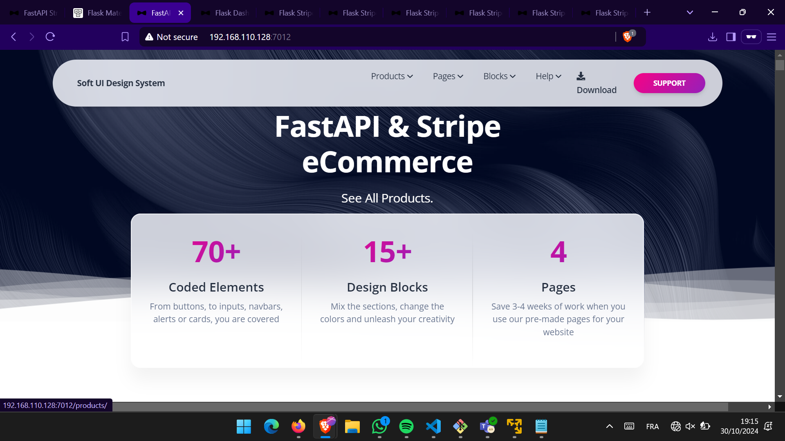
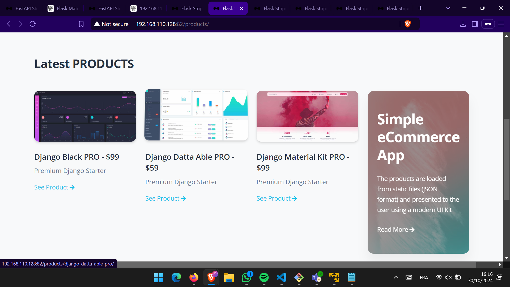
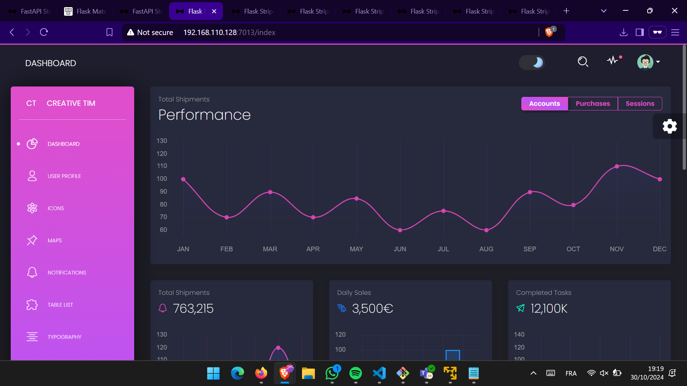
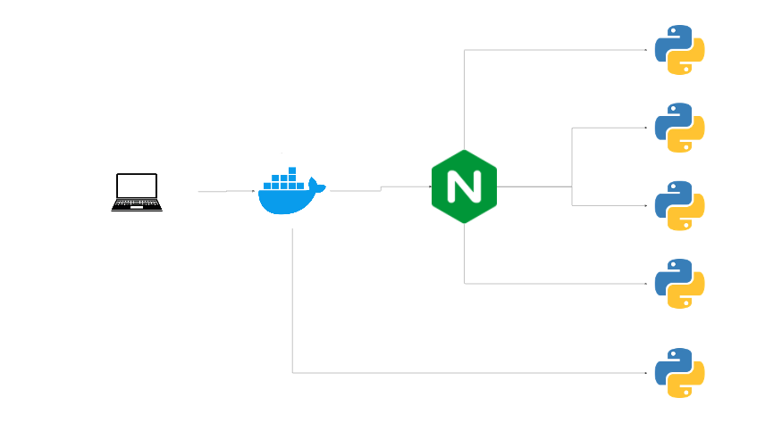

<!-- PROJECT LOGO -->
<br />
<div align="center">
 
  <h3 align="center">Projet E4 WMD Docker.md 2024-10-29</h3>

  <p align="center">
    <a href="https://github.com/othneildrew/Best-README-Template"><strong>Documentation »</strong></a>
    <br />
    <br />
    <a href="https://github.com/othneildrew/Best-README-Template">Github</a>
    ·
    <a href="https://github.com/othneildrew/Best-README-Template/issues/new?labels=bug&template=bug-report---.md">Docker Hub</a>
    ·
  </p>
</div>


<!-- TABLE OF CONTENTS -->
<details>
  <summary>Table des matières</summary>
  <ol>
    <li><a href="#Struture du projet">Struture du projet</a></li>
    <li><a href="#Struture du projet">Configurations</a></li>
    <li><a href="#Etape du build">Etape du build</a></li>
    <li><a href="#Logs">Logs</a></li>
    <li><a href="#Quelques Interfaces">Quelques Interfaces</a></li>
  </ol>
</details>


<!-- ABOUT THE PROJECT -->
## Struture du projet

Voici la structure du projet:

```bash
< PROJECT ROOT >
   |
   |-- devoir/
   |    |
   # applications
   |    |-- ecommerce-fastapi-stripe/
   |    |-- ecommerce-flask-stripe/
   |    |-- fastapi-ecommerce-demo/
   |    |-- flask-black-dashboard
   |    |-- flask-material-kit/
   # nginx configuraitons
   |    |-- nginx/ 
   |    |    |-- mynginxconf.conf                        
   # infrastructure as code (iac)
   |    |-- docker-compose.yml
   |
   ************************************************************************
```


<p align="right">(<a href="#readme-top">back to top</a>)</p>

<!-- FILES CONFIGURATIONS -->
## Configurations

. Contenu du fichier mynginxconf.conf

``` bash
# Application fastapi-ecommerce
upstream fastapi-ecommerce-demo {
    server fastapi-ecommerce-demo:5005;
}

server {
    listen 7010;
    server_name localhost;

    location / {
        proxy_pass http://fastapi-ecommerce-demo;
        proxy_set_header Host $host:$server_port;
        proxy_set_header X-Forwarded-For $proxy_add_x_forwarded_for;
    }

}


# Application flask-material-kit
upstream flask-material-kit {
    server flask-material-kit:8000;
}

server {
    listen 7011;
    server_name localhost;

    location / {
        proxy_pass http://flask-material-kit;
        proxy_set_header Host $host:$server_port;
        proxy_set_header X-Forwarded-For $proxy_add_x_forwarded_for;
    }

}

# Application ecommerce-fastapi-stripe
upstream ecommerce-fastapi-stripe {
    server ecommerce-fastapi-stripe:7000;
}

server {
    listen 7012;
    server_name localhost;

    location / {
        proxy_pass http://ecommerce-fastapi-stripe;
        proxy_set_header Host $host:$server_port;
        proxy_set_header X-Forwarded-For $proxy_add_x_forwarded_for;
    }

}

# Application flask-black-dashboard
upstream flask-black-dashboard {
    server flask-black-dashboard:5085;
}

server {
    listen 7013;
    server_name localhost;

    location / {
        proxy_pass http://flask-black-dashboard;
        proxy_set_header Host $host:$server_port;
        proxy_set_header X-Forwarded-For $proxy_add_x_forwarded_for;
    }

}
```

. Contenu du docker-compose.yml

``` bash
#version: '3.8'
services:
  fastapi-ecommerce-demo:
    restart: always
    # build: ./fastapi-ecommerce-demo
    image: "arnaud2210/fastapi-ecommerce-demo:prod"
    # ports:
    #  - "5005:5005"
    networks:
      - db_network
      - web_network
  
  flask-material-kit:
    restart: always
    # build: ./flask-material-kit
    image: "arnaud2210/flask-material-kit:prod"
    # ports:
    #  - "8000:8000"
    networks:
      - db_network
      - web_network
    
  ecommerce-fastapi-stripe:
    restart: always
    # build: ./ecommerce-fastapi-stripe
    image: "arnaud2210/ecommerce-fastapi-strip:prod"
    # ports:
    #  - "7000:7000"
    networks:
      - db_network
      - web_network
  
  ecommerce-flask-stripe:
    restart: always
    # build: ./ecommerce-flask-stripe
    image: "arnaud2210/ecommerce-flask-stripe:prod"
    ports:
      - "80:80"
    networks:
      - db_network
      - web_network
  
  ecommerce-flask-stripe-replicas:
    restart: always
    build: ./ecommerce-flask-stripe
    deploy:
      replicas: 5
    ports:
      - "81-86:80"
    networks:
      - db_network
      - web_network
  
  flask-black-dashboard:
    restart: always
    #build: ./flask-black-dashboard
    image: "arnaud2210/flask-black-dashboard:prod"
    # ports:
    #  - "5085:5085"
    networks:
      - db_network
      - web_network
  
  nginx:
    restart: always
    image: "nginx:mainline-alpine3.20-slim"
    ports:
      - "7010:7010"
      - "7011:7011"
      - "7012:7012"
      - "7013:7013"
    volumes:
      - ./nginx:/etc/nginx/conf.d
    networks:
      - web_network
    depends_on: 
      - fastapi-ecommerce-demo
      - flask-material-kit
      - ecommerce-fastapi-stripe
      - flask-black-dashboard
  
networks:
  db_network:
    driver: bridge
  web_network:
    driver: bridge 
```

<!-- GETTING STARTED -->
## Etape du build

### Pour déployer les applications du répertoire "devoir":

1- Positionnez vous dans ce répertoire avec la commande suivante:

``` bash
cd devoir
```

2- Exécuter la commande suivante pour mettre en place votre iac:

``` bash
docker compose up -d
```

3- Après le build, tapez les commandes suivantes:

``` bash
docker images
```

. Screen présentant les images



``` bash
docker ps
```
ou
``` bash
docker ps -a
```
. Screen présentant les conteneurs en cours d'exécution



Testez vos applications en local sur les ports suivants:
  <ul>
    <li><a href="#http://localhost:7010">http://localhost:7010</a></li>
    <li><a href="#http://localhost:7011">http://localhost:7011</a></li>
    <li><a href="#http://localhost:7012">http://localhost:7012</a></li>
    <li><a href="#http://localhost:7013">http://localhost:7013</a></li>
    <li><a href="#http://localhost:80">http://localhost:80</a></li>
    <li><a href="#http://localhost:81">http://localhost:81</a></li>
    <li><a href="#http://localhost:82">http://localhost:82</a></li>
    <li><a href="#http://localhost:83">http://localhost:83</a></li>
    <li><a href="#http://localhost:84">http://localhost:84</a></li>
    <li><a href="#http://localhost:85">http://localhost:85</a></li>
    <li><a href="#http://localhost:86">http://localhost:86</a></li>
  </ul>

4- Pushez vos images sur le docker hub

. Connectez vous au docker hub:

``` bash
docker login
```

. Déplacer dans le répertoire de l'application pour exécuter les commandes suivantes:
``` bash
cd  nom_application
```

``` bash
docker build -t nom_image:tag_name .
```

``` bash
docker tag nom_image:tag: your_username/nom_image:tag_name_for_hub
```

``` bash
docker push your_username/nom_image:tag_name_for_hub
```


. Screen présentant les logs obtenus lors d'un push



. Docker Hub repositories



<p align="right">(<a href="#readme-top">back to top</a>)</p>


<!-- INTERFACES -->
## Quelques interfaces

. ecommerce-fastapi-stripe



. ecommerce-flask-stripe



. flask-black-dashboard




## Docker

1. La solution docker dans ce projet nous permet d'optimiser notre déploiement en minimisant le temps du build pour la mise en production tout en maintenant la portabilité de notre infrastructure en cas de changement.

2. Docker s'inscrit dans la méthodologie DevOps en facilitant l'intégration continue et le déploiement automatique des applications en passant par la conteneurisation des applications (packaging), le gain de temps lors du déploiement grâce à l'automatisation et la création des pipelines CI/CD, la portabilité et la sécurité des applications.

## Diagramme iac

